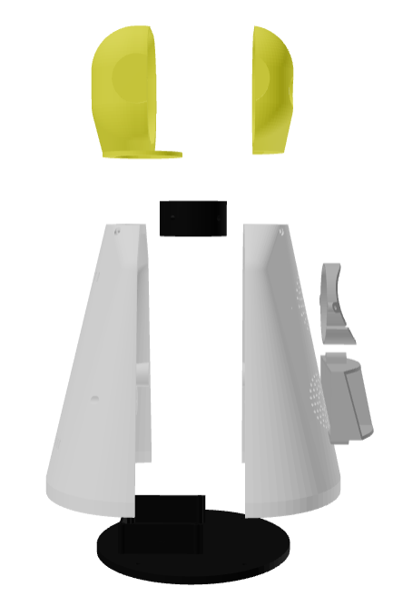
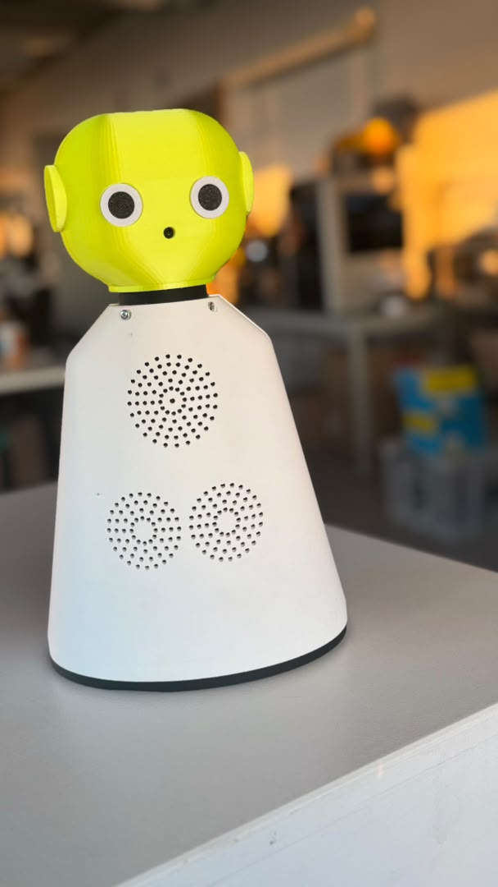
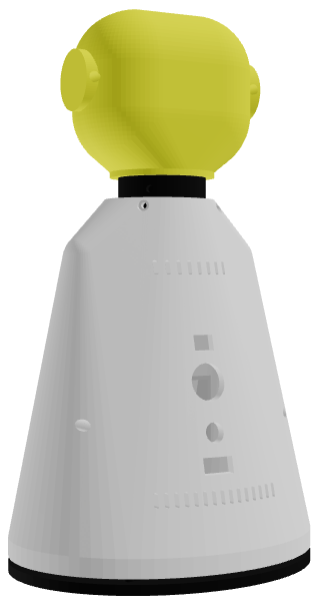
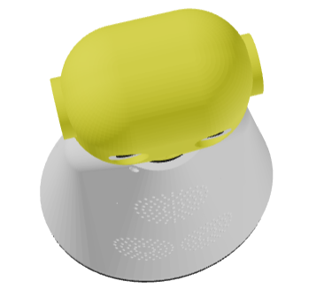
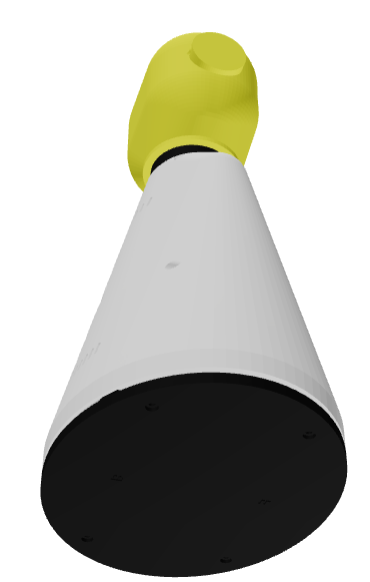

# 🤖 Open-Source Modular Robot Design (OpenSCAD & 3MF)

Welcome to the official repository for **robot_prototype_3D_sourcecode** created by **[@ranboy12](https://github.com/ranboy12)**.

This project features a 3D-printable desktop robot chassis with a parametric and modular design. It includes the OpenSCAD source code, 3MF files prepared for printing, and preview images of the designed and assembled robot.

---

## 📁 Repository Structure

* 📂 **`source_codes/`**
    * 📄 `full_robot_source_code.scad` — Master OpenSCAD source code with full parametric design and "exploded view" controls.
* 📂 **`robot_design_read_for_print (3MF files)/`**
    * Includes pre-configured 3MF files for slicers (like Bambu Studio, PrusaSlicer, or Cura).
    * Key components: `base_plate.3mf`, `eyes_components.3mf`, `front_torso.3mf`, `rear_torso.3mf`, `neck.3mf`, etc.
* 📂 **`source_code_output_preview/`**
    * Contains render images from OpenSCAD and real photos of the assembled robot.

---

## 🤖 Technical Features

* **Parametric Design:** Easily change sizes and colors via variables within the `.scad` file.
* **Head & Neck:** Includes sections for stereo eyes, an internal camera, ribbon cable paths, and a servo motor slot for head rotation.
* **Audio System:** Dedicated internal mounts for dual speakers and a microphone.
* **UPS & Power Base:** Built-in internal box for a UPS/Battery PCB with identification numbers ("2", "3", "4") and direction markers ("F" for Front, "B" for Back) for easy assembly.
* **Modular Torso:** Front and rear piece design with ventilation grilles and ports for external connectivity.
* **Exploded View Control:** Use the `explode_distance` variable to inspect the internal component layout.

---

## 🖼️ Gallery

| OpenSCAD Render | Assembled Model |
| :---: | :---: |
|  |  |

### Additional Images
* **Rear View:** 
* **Exploded View:** 
* **Top View:** 
* **Bottom View:** 

---

## 🛠️ How to Use & Customize

### 1. 🖨️ Using 3MF Files (For 3D Printing)
1. Clone this repository:
   ```bash
   git clone https://github.com/ranboy12/robot_prototype_3D_sourcecode.git
   ```
2. Open the `robot_design_read_for_print (3MF files)/` folder.
3. Import the `.3mf` files into your 3D slicer software (e.g., Bambu Studio) and start printing.

### 2. 🌐 Modifying Source Code Online (No Installation Required)
You can view and modify the `.scad` code directly in your browser:
1. Copy the contents of `source_codes/full_robot_source_code.scad`.
2. Open an online editor like **OpenSCAD Playground** or **DevToolsDaily OpenSCAD**.
3. Paste the code to see the 3D render.
4. Change variables like `explode_distance` or colors directly.

### 3. 💻 Using OpenSCAD Software (Desktop)
1. Download and install [OpenSCAD](https://openscad.org/).
2. Open `source_codes/full_robot_source_code.scad`.
3. Modify the variables at the beginning of the file:
   ```openscad
   // --- MASTER EXPLODE CONTROL ---
   explode_distance = 0; // 0 = assembled, >0 = exploded view

   // --- COLORS ---
   color_head_face = "yellow";
   color_neck      = "black";
   ```
4. Press **F5** to preview changes, **F6** to render, and **F7** to export STL files for printing.

---

## 📜 License
This project is released under the **MIT License / Open Source**. You are allowed to use, modify, and distribute it for personal, educational, or commercial projects.
